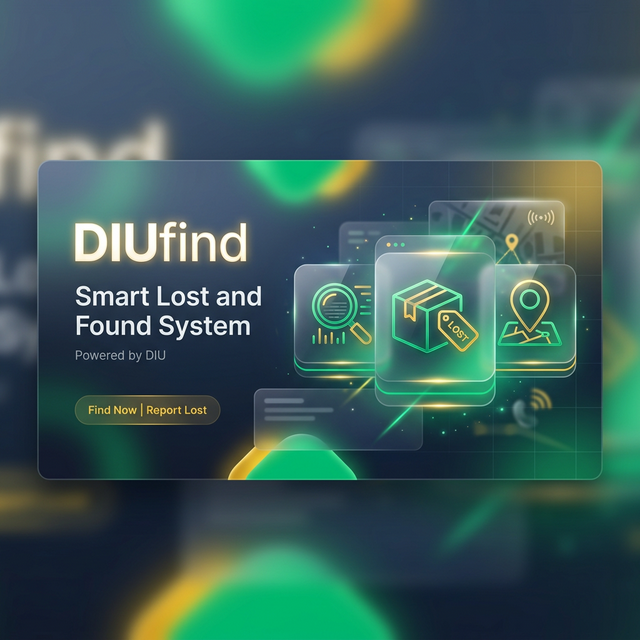

#  DIUfind - Smart Lost & Found System

<div align="center">

[](https://visitorbadge.io/status?path=TheSourav-001%2FDIUFind)
[](https://www.php.net/)
[](https://www.mysql.com/)
[](https://opensource.org/licenses/MIT)


</div>

---

## 🌟 Overview

**DIUfind** is a state-of-the-art, feature-rich web platform designed for the **Daffodil International University (DIU)** community. It bridges the gap between losing an item and finding it, using an AI-powered smart matching approach, interactive campus maps, and a gamified trust system.



### 🔴 The Problem
Traditional campus lost & found processes are fragmented, slow, and often rely on physical notices or unorganized social media groups.

### 🟢 The Solution (DIUfind)
A centralized, secure, and real-time portal that organizes reports, verifies ownership, and rewards honesty through a premium-grade user experience.

---

## 🚀 Key Features

| | Feature | Description |
|---|---|---|
| 📦 | **Smart Management** | Advanced reporting with images, categories, and real-time status tracking. |
| 🗺️ | **Interactive Map** | Live campus map with item hotspots and instant location markers. |
| 🏆 | **Gamification** | "Hall of Fame" leaderboard rewarding heroes with **Honesty Points**. |
| 🛡️ | **Enterprise Security** | CSRF protection, Rate Limiting, and XSS prevention for total peace of mind. |
| 🔔 | **Smart Sync** | Real-time AJAX notifications for comments, claims, and reactions. |
| 📄 | **Poster Engine** | Automatic PDF "Lost/Found" poster generation for physical notice boards. |

---

## 🖼️ System Preview

<div align="center">

| Dashboard Insights | Mobile Experience |
| --- | --- |
|  |  |

</div>

---

## 🏗️ Architecture

DIUfind follows a robust **Model-View-Controller (MVC)** architectural pattern to ensure scalability and clean code separation.

```mermaid
graph TD
    A[Public Browser] -->|Routes| B[Core Router]
    B -->|Calls| C[Controllers]
    C -->|Requests Data| D[Models]
    D -->|Queries| E[(MySQL Database)]
    C -->|Loads| F[Views/UI Components]
    F -->|Renders| A
    subgraph Security Layer
        G[CSRF Guard]
        H[Rate Limiter]
        I[XSS Encoder]
        J[Secure Session]
    end
    C -.-> Security Layer
```

---

## 🛡️ Security Hardening

As a security-first platform, DIUfind implements several industry-standard protections:

- **CSRF Protection**: Synchronizer token pattern for all state-changing requests.
- **Rate Limiting**: Integrated anti-brute force and anti-spam mechanisms (5/min for login, 3/5min for posts).
- **Secure Sessions**: SameSite=Strict, HttpOnly, and Secure flags with 30-minute inactivity timeouts.
- **XSS Prevention**: Centralized output encoding using context-aware sanitization.
- **SQLi Protection**: 100% PDO Prepared Statements across the data layer.
- **CSP Headers**: Strict Content Security Policy allowing only trusted CDNs.

---

## 🛠️ Installation Guide

### Prerequisites
- PHP 7.4+
- MySQL / MariaDB
- Web Server (Apache/Nginx)

### Setup Steps
1. **Clone the project**:
   ```bash
   git clone https://github.com/TheSourav-001/DIUFind.git
   ```
2. **Setup Database**:
   - Create a database `diufind_db`.
   - Import the schema from `app/config/diufind_db.sql`.
3. **Environment Configuration**:
   - Create a `.env` file in the root directory:
     ```env
     DB_HOST=localhost
     DB_USER=root
     DB_PASS=
     DB_NAME=diufind_db
     APP_SECRET=your_secret_key
     APP_URL=http://localhost/DIUfind/public
     ```
4. **Permissions**:
   - Ensure `public/uploads/` is writable by the server.

---

## 👨‍💻 Developed By

**Sourav Dipto Apu**  
*Senior Full-Stack Developer & Security Enthusiast*

[](https://linkedin.com/in/thesourav)
[](https://github.com/TheSourav-001)

---
<div align="center">
  <sub>Built with ❤️ for the DIU Community</sub>
</div>
